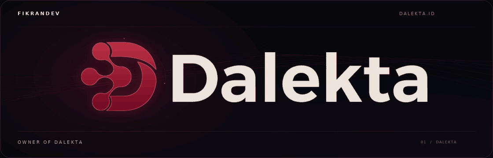

<h1 align="center">FikranDev</h1>

  <strong>AI Engineering · Full-Stack Development · Conversion Tracking</strong>

  Mohammad Fikran · AI engineer and full-stack developer based in Bekasi, Indonesia. 
  I build AI agents, automate business workflows, and connect marketing data to sales. 
  Founder of <a href="https://dalekta.id/">Dalekta</a> · AI Club Bekasi organizer

  <a href="https://fikran.dev/">Website</a> ·
  <a href="https://dalekta.id/">Dalekta</a> ·
  <a href="https://github.com/Mhmdfikran">GitHub</a> ·
  <a href="https://www.instagram.com/mhmdfikrann/">Instagram</a>

  

---

## What I Build · Fokus

My work starts with the process a team needs to run: answering customers, following up leads, moving data between tools, or understanding where a sale came from. I build the application, agent, and integrations around that process.

- **AI agents:** business-aware assistants for customer conversations, FAQs, and lead qualification, with clear instructions and human handoff
- **Automation:** connected workflows for follow-ups, reporting, and repetitive operational tasks
- **Web applications:** websites, dashboards, internal portals, and API integrations
- **Technical marketing:** landing pages, conversion tracking, attribution, and campaign measurement

## Featured Product · Produk

### [Dalekta](https://dalekta.id/)

**Follow the journey from an ad click to a WhatsApp sale.**

Dalekta connects campaign sources, WhatsApp leads, funnel stages, and recorded sales value so marketing and sales can work from the same data.

- Preserves available UTM parameters and click IDs through the landing-page journey
- Connects tracked WhatsApp conversations to their campaign source
- Records lead progress through qualification, follow-up, and closing
- Reports recorded revenue alongside campaign and lead data
- Sends mapped conversion events through Meta Conversions API when the required configuration is active
- Supports WhatsApp AI agents with product knowledge, workspace-controlled memory, and human takeover

[Explore Dalekta →](https://dalekta.id/)

## Independent Work · FikranDev

[FikranDev](https://fikran.dev/) is where I build custom applications, AI agents, and automation for businesses. Projects can cover a complete workflow or a focused piece, such as an internal dashboard, an API integration, or a tracking implementation.

AI engineering is my main focus. Web development and digital marketing support the work when the problem calls for them.

## Tools & Systems · Teknologi

`AI Agents` `API Integrations` `Webhooks` `WhatsApp Workflows`  
`Meta Conversions API` `Meta Ads` `Google Ads` `UTM & Click-ID Tracking`

## Community · Komunitas

I organize **AI Club Bekasi**, alongside my product and engineering work.

## Connect · Terhubung

For project discussions and collaboration, visit [fikran.dev](https://fikran.dev/). You can also find me on [Instagram](https://www.instagram.com/mhmdfikrann/) and [Threads](https://www.threads.com/@mhmdfikrann).
